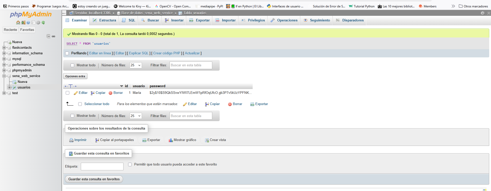
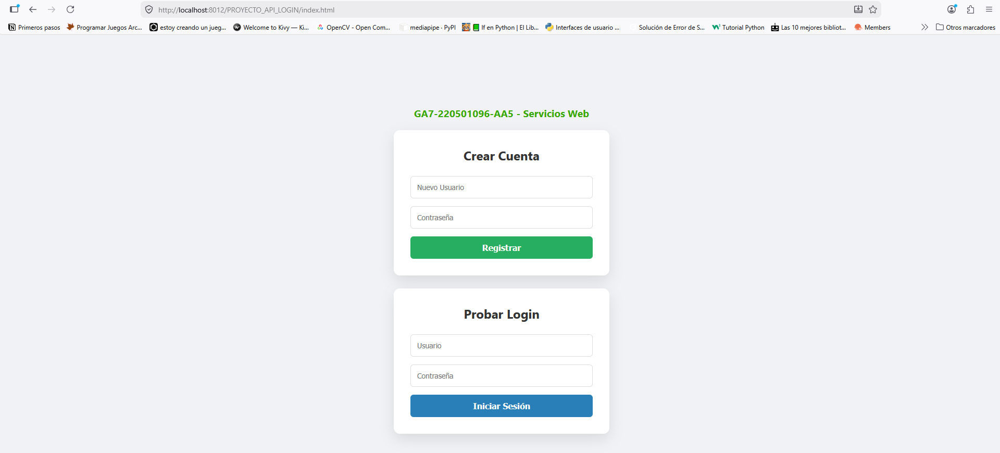

# Actividad de Aprendizaje: Crear Servicios Web (GA7-220501096-AA5)

Este proyecto consiste en el diseño y desarrollo de una API de autenticación básica (Registro y Login) utilizando **PHP** y **MySQL**. La actividad forma parte de la fase de codificación del proyecto de software.

## 🚀 Funcionalidades
- **Registro de usuarios**: Recibe credenciales y las almacena de forma segura en la base de datos.
- **Cifrado de seguridad**: Las contraseñas se almacenan utilizando `password_hash` con el algoritmo BCRYPT.
- **Inicio de sesión**: Verifica las credenciales y devuelve una respuesta en formato JSON.
- **Servicio Web**: Respuestas estandarizadas para integración con front-end o aplicaciones móviles.

## 🛠️ Tecnologías utilizadas
- **Backend**: PHP 8.x (PDO para conexión segura).
- **Base de Datos**: MySQL / MariaDB.
- **Entorno de Servidor**: XAMPP.
- **Control de Versiones**: Git / GitHub.
- **Diseño**: HTML5 y CSS3.

## 📋 Requisitos e Instalación

1. **Clonar el repositorio:**
   ```bash
   git clone https://github.com
   ```

2. **Configurar la Base de Datos:**
   - Importar el archivo SQL o crear la base de datos `sena_web_service`.
   - Crear la tabla `usuarios` con los campos `id`, `usuario` y `password`.

3. **Configuración del Servidor:**
   - Asegurarse de que XAMPP esté corriendo Apache y MySQL.
   - Ajustar el puerto en `config.php` si es necesario (actualmente configurado en el puerto 3306).


## 🧪 Pruebas de la API
Para probar el servicio, se puede utilizar el archivo `index.html` incluido o herramientas como **Postman**.

---

## 📊 Evidencia de Base de Datos
Se verifica que los usuarios se registran correctamente en la tabla `usuarios`, almacenando la contraseña de forma cifrada para mayor seguridad.



---

## 🖥️ Interfaz del Proyecto
Se desarrolló una interfaz limpia y amigable para facilitar las pruebas de los servicios web de Registro y Login.




- **Respuesta exitosa de Login:**
  ```json
  {
    "status": "success",
    "mensaje": "autenticación satisfactoria"
  }
  ```

## 👤 Autor
- **Aprendiz:** [TU NOMBRE COMPLETO]
- **Ficha:** [TU NÚMERO DE FICHA]
- **Instructor:** [NOMBRE DE TU INSTRUCTOR]
